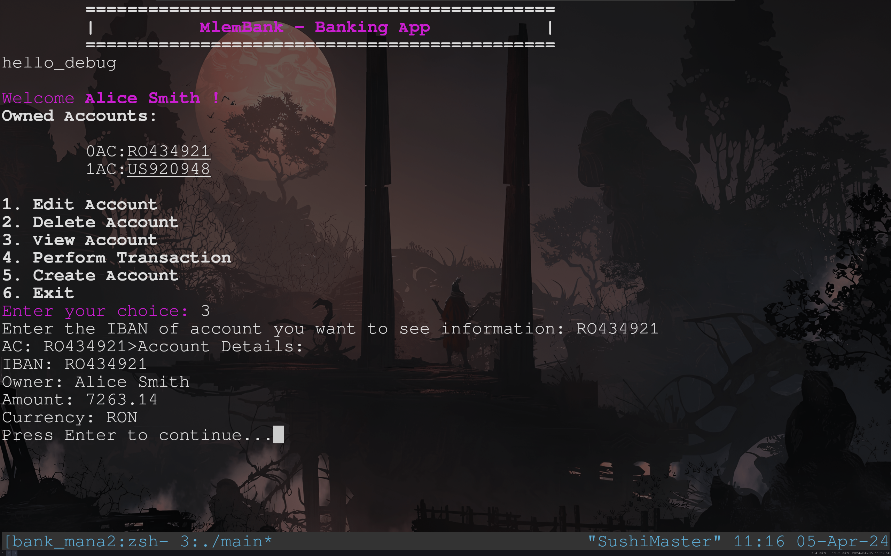
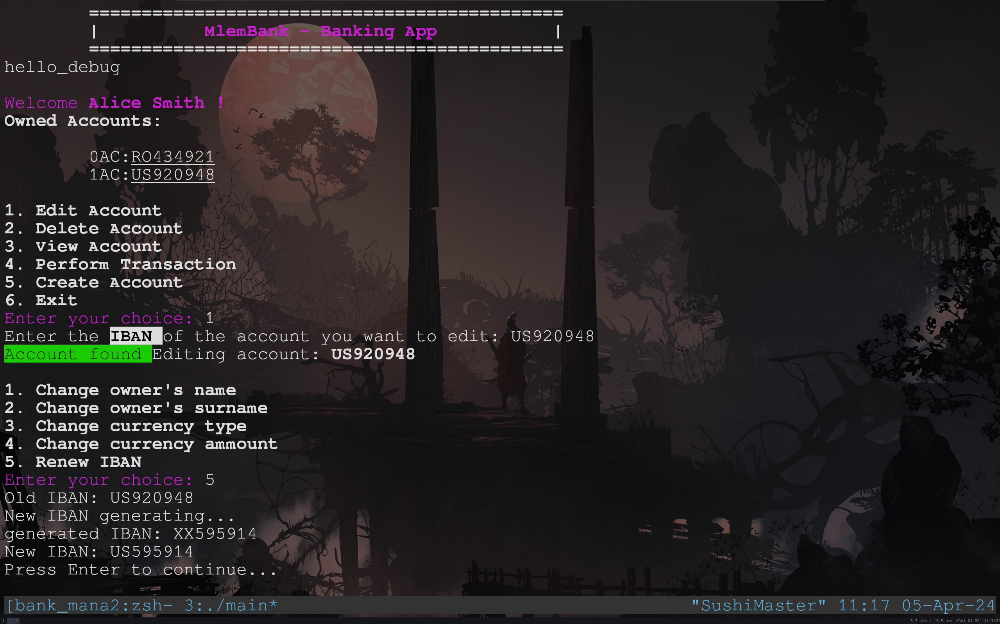
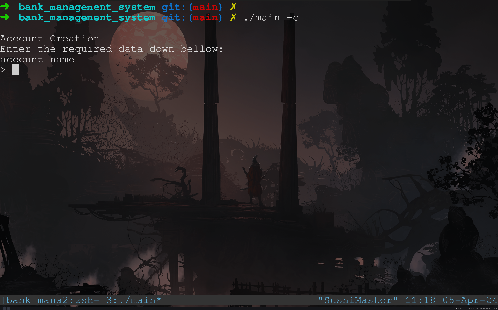

# bank_management_system

## Account Creation: 
- Allows bank staff to create new customer accounts by inputting necessary details such as name, surname, currency, etc.

## Deposit and Withdrawal: 
- Enables account holders to deposit or withdraw funds from their accounts. Users can specify the amount to deposit/withdraw and the system updates the account balance accordingly.

## Balance Inquiry: 
- Provides account holders with their current balance upon request.

## Account Management: 
- Allows bank staff to perform administrative tasks such as updating customer information, closing accounts, etc.

## Error Handling: 
- Incorporates error handling mechanisms to manage scenarios such as insufficient funds, invalid inputs, etc., ensuring smooth operation of the system.

## Transactions between accounts:
- Enables transactions of a specific currency and ammount between different accounts.
##
> [!NOTE]  
> more features to be added.
### Instalation
    git clone https://github.com/ml3m/bank_management_system
##
    make

## Usage:
### Connect to an existing user in database
    ./login [NAME] [SURNAME]
### Create Account (new user)
    ./login -c
or

    ./login -create
##

</a>

</a>

</a>

